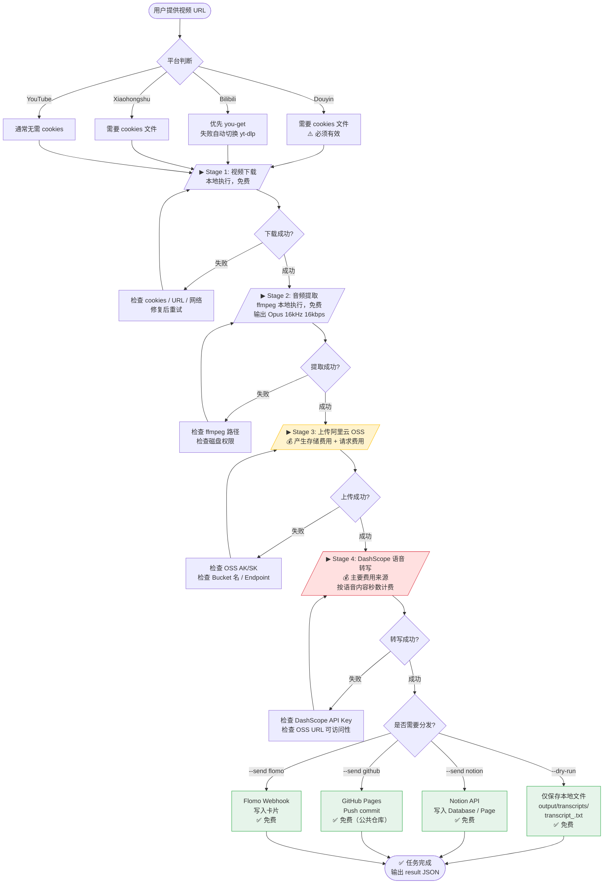

# Universal Transcriber — 完整流程图与费用说明

> 文档版本：2026-06-03 | 基于 `SKILL.md` 及阿里云官方定价页面整理

---

## 目录

1. [整体架构概览](#1-整体架构概览)
2. [详细执行流程图](#2-详细执行流程图)
3. [各阶段说明](#3-各阶段说明)
4. [费用涉及服务总览](#4-费用涉及服务总览)
5. [阿里云 OSS 费用明细](#5-阿里云-oss-费用明细)
6. [DashScope Paraformer 语音识别费用明细](#6-dashscope-paraformer-语音识别费用明细)
7. [第三方分发服务费用](#7-第三方分发服务费用)
8. [典型场景费用估算](#8-典型场景费用估算)
9. [降本建议](#9-降本建议)
10. [费用风险提示](#10-费用风险提示)

---

## 1. 整体架构概览

```
用户输入 URL
     │
     ▼
┌─────────────────────────────────────────────────────────┐
│                  本地机器（免费）                          │
│  yt-dlp / you-get / Playwright  →  ffmpeg 音频提取        │
└──────────────────────┬──────────────────────────────────┘
                       │ Opus 音频文件（~10–15 MB / 1.5h）
                       ▼
┌─────────────────────────────────────────────────────────┐
│            阿里云 OSS（💰 少量费用）                       │
│  上传存储  →  生成临时 URL  →  转写完成后可删除             │
└──────────────────────┬──────────────────────────────────┘
                       │ OSS 文件 URL
                       ▼
┌─────────────────────────────────────────────────────────┐
│         DashScope Paraformer 语音识别（💰 主要费用）        │
│  提交异步任务  →  轮询结果  →  返回结构化转写文本            │
└──────────────────────┬──────────────────────────────────┘
                       │ 转写文本
                       ▼
┌─────────────────────────────────────────────────────────┐
│             分发层（免费 API）                             │
│  Notion API  /  GitHub Pages  /  Flomo Webhook           │
│  + 本地 transcript_<task_id>.txt 文件                    │
└─────────────────────────────────────────────────────────┘
```

---

## 2. 详细执行流程图



---

## 3. 各阶段说明

| 阶段 | 执行位置 | 工具/服务 | 是否产生费用 |
|------|---------|----------|------------|
| **Stage 1** 视频/音频下载 | 本地机器 | yt-dlp、you-get、Playwright | ❌ 免费 |
| **Stage 2** 音频提取转码 | 本地机器 | ffmpeg | ❌ 免费 |
| **Stage 3** 上传 OSS | 阿里云 | 阿里云 Object Storage Service | ⚠️ 少量费用 |
| **Stage 4** 语音转写 | 阿里云云端 | DashScope Paraformer API | 💰 **主要费用** |
| **Stage 5** 分发 | 第三方服务 | Notion / GitHub / Flomo | ❌ 免费 |

---

## 4. 费用涉及服务总览

```
┌──────────────────────────────────────────────────────────────────┐
│                     费用地图                                       │
│                                                                    │
│  本地计算：下载 + ffmpeg                   【完全免费】             │
│                                                                    │
│  ┌──────────────────────────────┐                                 │
│  │  阿里云 OSS                  │  💰 少量费用                     │
│  │  · 存储费：0.09 元/GB/月     │  (1.5h 视频约 < 0.002 元/次)    │
│  │  · 流量费：上传免费           │                                  │
│  │  · 请求费：基本在免费额度内   │                                  │
│  └──────────────────────────────┘                                 │
│                                                                    │
│  ┌──────────────────────────────┐                                 │
│  │  DashScope Paraformer        │  💰 主要费用                     │
│  │  · 0.00008 元/秒             │  (1h 视频约 0.29 元)            │
│  │  · 每月免费 10 小时           │  (月用 < 10h 完全免费)          │
│  └──────────────────────────────┘                                 │
│                                                                    │
│  分发层：Notion / GitHub / Flomo           【完全免费】             │
└──────────────────────────────────────────────────────────────────┘
```

---

## 5. 阿里云 OSS 费用明细

> 数据来源：[阿里云 OSS 官方定价](https://help.aliyun.com/zh/oss/product-overview/billing-overview)，中国大陆地域，标准型

### 5.1 存储费用

| 存储类型 | 冗余方式 | 单价 | Pipeline 用途 |
|---------|---------|------|-------------|
| 标准型 | 本地冗余（LRS） | **0.09 元/GB/月** | 默认推荐 |
| 标准型 | 同城冗余（ZRS） | 0.12 元/GB/月 | 更高可靠性 |

> **说明**：Pipeline 上传的是经 ffmpeg 压缩后的 Opus 音频（约 10–15 MB/1.5h），**转写完成后可立即删除**，实际存储时间仅几分钟，存储费用极低（< 0.0001 元/次）。

---

### 5.2 流量费用

| 方向 | 费用 |
|------|------|
| 本地 → OSS 上传（公网入流量） | **免费** ✅ |
| 内网流出（ECS 同地域访问） | **免费** ✅ |
| 公网流出（忙时 08:00–24:00） | **0.50 元/GB** |
| 公网流出（闲时 00:00–08:00） | **0.25 元/GB** |

> **说明**：DashScope 服务通过 URL 拉取 OSS 文件时，若与 OSS 同在阿里云内网，流量免费。实际情况中 DashScope 调用为**云端内网访问**，通常不产生流出流量费用。上传到 OSS 的操作本身永远免费。

---

### 5.3 请求费用

| 请求类型 | 每月免费额度 | 超出单价 |
|---------|------------|---------|
| PUT / POST / 上传写入 | **前 1 亿次/月免费** | 0.01 元/万次 |
| GET / HEAD / 读取 | **前 5 亿次/月免费** | 0.01 元/万次 |

> **说明**：个人或小团队使用，每月请求次数远低于免费额度，**请求费用几乎为零**。

---

### 5.4 OSS 新用户免费额度

| 资源类型 | 免费额度 | 有效期 |
|---------|---------|-------|
| 标准存储容量 | 40 GB | 开通后 6 个月 |
| 公网流出流量 | 每月 15 GB | 开通后 6 个月 |
| 请求次数 | 每月 200 万次 | 开通后 6 个月 |

---

## 6. DashScope Paraformer 语音识别费用明细

> 数据来源：[阿里云 DashScope 计量计费](https://help.aliyun.com/zh/isi/developer-reference/metering-and-billing)  
> 适用模型：`paraformer-v2`（pipeline 默认使用）

### 6.1 计费方式

| 项目 | 说明 |
|------|------|
| **计费单元** | 秒（不足 1 秒四舍五入） |
| **计费单价** | **0.00008 元/秒**（≈ 0.288 元/小时） |
| **计费对象** | 仅对音轨中被判定为**语音内容**的时长计费，静音/背景音不计费 |
| **计算字段** | 结果 JSON 中的 `content_duration`（毫秒） |

### 6.2 免费额度

| 模型 | 每月免费额度 | 换算 | 生效时间 |
|------|------------|------|---------|
| paraformer-v2（含 paraformer-1、8k、mtl） | **36,000 秒** | **= 10 小时** | 每月 1 日 0 点重置 |

> 💡 **关键结论**：每月处理视频总时长在 **10 小时以内完全免费**。普通个人用户日常使用通常不会超出免费额度。

### 6.3 超出免费额度后的收费

| 月用量 | 单价 |
|-------|------|
| 超出 36,000 秒部分 | **0.00008 元/秒** |
| 等价换算 | **0.288 元/小时**，约 **17.28 元/100小时** |

### 6.4 费用计算示例

| 视频时长 | 语音内容估算（80%） | 月处理量 | 费用估算 |
|---------|----------------|---------|---------|
| 10 分钟/条 | 480 秒 | 10 条/月 | **免费**（共 4800 秒 < 36000 秒） |
| 1 小时/条 | 2880 秒 | 3 条/月 | **免费**（共 8640 秒 < 36000 秒） |
| 1.5 小时/条 | 4320 秒 | 8 条/月 | 超出约 1560 秒 ≈ **0.12 元** |
| 1.5 小时/条 | 4320 秒 | 20 条/月 | 超出约 50400 秒 ≈ **4.03 元** |

---

## 7. 第三方分发服务费用

| 服务 | 计费情况 | 说明 |
|------|---------|------|
| **Notion API** | ✅ 完全免费 | 个人计划免费；内容写入 Database/Page 无调用费 |
| **GitHub API** | ✅ 完全免费 | 公开/私有仓库均可用；GitHub Actions 有免费额度（不涉及本 pipeline）|
| **Flomo Webhook** | ✅ 完全免费 | 通过 HTTP Webhook 写入卡片，无调用费 |
| **本地文件输出** | ✅ 完全免费 | 写入 `output/transcripts/transcript_<task_id>.txt` |

---

## 8. 典型场景费用估算

> 以下估算适用于中国大陆地区，标准型 OSS + DashScope Paraformer，个人用户规模。

### 场景 A：轻度使用（个人学习，每月 5–10 条短视频）

| 费用项 | 金额 |
|-------|------|
| OSS 存储（新用户免费期内） | 0 元 |
| OSS 流量（上传免费）| 0 元 |
| DashScope（在 10 小时免费额度内）| 0 元 |
| 分发到 Notion/GitHub/Flomo | 0 元 |
| **月度总费用** | **0 元** |

---

### 场景 B：中度使用（内容创作者，每月 20 条 × 1 小时）

| 费用项 | 计算 | 金额 |
|-------|------|------|
| OSS 存储 | 20 条 × 12 MB × 短暂存储 ≈ 可忽略 | ~0 元 |
| OSS 流量 | 上传免费，内网访问免费 | 0 元 |
| DashScope 转写 | 20h × 3600 秒 × 0.8（语音比例）= 57,600 秒<br>免费 36,000 秒，超出 21,600 秒 × 0.00008 | **≈ 1.73 元** |
| 分发服务 | 免费 | 0 元 |
| **月度总费用** | | **≈ 1.73 元** |

---

### 场景 C：重度使用（团队批量处理，每月 100 条 × 1.5 小时）

| 费用项 | 计算 | 金额 |
|-------|------|------|
| OSS 存储 | 可忽略（及时删除） | ~0 元 |
| OSS 流量 | 上传免费，内网访问免费 | 0 元 |
| DashScope 转写 | 150h × 3600 × 0.8 = 432,000 秒<br>免费 36,000 秒，超出 396,000 秒 × 0.00008 | **≈ 31.68 元** |
| 分发服务 | 免费 | 0 元 |
| **月度总费用** | | **≈ 31.68 元** |

---

## 9. 降本建议

### ✅ 优先利用免费额度
- **每月前 10 小时转写完全免费**，合理规划使用时间，避免月初集中消耗。
- 阿里云新账号 OSS 有 **6 个月免费期**，新用户前期几乎零成本。

### ✅ 及时删除 OSS 临时文件
- Pipeline 默认转写完成后删除音频（`--save-video` 未指定时），保持 OSS 存储极低。
- 若自行保留文件，记得手动清理或设置 **OSS 生命周期规则**（自动删除 N 天前的对象）。

### ✅ 选择闲时处理
- OSS 公网下行流量闲时（00:00–08:00）比忙时便宜 50%（0.25 vs 0.50 元/GB）。
- 若有大批量处理需求，可安排在凌晨运行。

### ✅ 使用音频专用（Audio-only）模式
- 默认模式仅下载音轨，**比全视频模式快 2–3 倍**，同时减少磁盘和带宽消耗。
- 只有明确需要保留视频文件时才加 `--save-video`。

### ✅ 购买资源包（大规模使用时）
| 方案 | 适用量级 | 优惠价 |
|------|---------|-------|
| DashScope 预付费（阿里云百炼）| 月处理 > 50 小时 | 可联系商务或购买预付费套餐 |
| OSS 存储包 | 存储量 > 40 GB | 500 GB/年 ≈ 118 元（≈ 0.02 元/GB/月） |
| OSS 流量包 | 公网流出 > 15 GB/月 | 1 TB 流量包约 153.6 元（半年有效） |

---

## 10. 费用风险提示

| 风险点 | 说明 | 建议 |
|-------|------|------|
| ⚠️ **OSS 文件未清理** | 大量音频文件积累会持续产生存储费 | 设置生命周期规则自动删除 |
| ⚠️ **OSS 公网流出** | 若在公网（非阿里云内网）读取 OSS 文件，会产生流出流量费 | 优先使用内网 Endpoint |
| ⚠️ **DashScope 超出免费额度** | 月累计超过 10 小时后开始收费 | 在阿里云控制台设置费用预警 |
| ⚠️ **API Key 泄露** | OSS AK/SK 或 DashScope API Key 泄露可能导致他人盗用产生费用 | 妥善保管 `config.json`，不上传至 GitHub |
| ⚠️ **多轨音频** | 若指定转写多轨，每条音轨单独计费 | 默认只转写首轨（单轨计费） |
| ⚠️ **重复提交任务** | 程序异常时可能重复提交转写任务 | 检查日志，避免重复扣费 |

---

## 附录：快速费用速查

```
1 分钟视频（语音 80%）：
  → 语音时长 ≈ 48 秒
  → 费用 ≈ 48 × 0.00008 = 0.0038 元

1 小时视频（语音 80%）：
  → 语音时长 ≈ 2880 秒
  → 费用 ≈ 2880 × 0.00008 = 0.23 元

每月免费上限：
  → 10 小时 = 600 分钟视频（按 100% 语音计）
  → 约 12.5 小时视频（按 80% 语音比例计）

OSS 10 MB 音频文件：
  → 存储 1 天：0.09 元/GB/月 × 0.01 GB × (1/30) ≈ 0.00003 元（约等于免费）
  → 上传流量：免费
```

---

> 📌 **价格更新说明**：本文档价格基于 2026 年 6 月阿里云官方定价。DashScope 和 OSS 定价可能随时调整，请以[阿里云官方价格页面](https://help.aliyun.com/zh/isi/developer-reference/metering-and-billing)为准。

> 📌 **参考链接**：
> - DashScope Paraformer 计费：https://help.aliyun.com/zh/isi/developer-reference/metering-and-billing
> - 阿里云 OSS 计费：https://help.aliyun.com/zh/oss/product-overview/billing-overview
> - OSS 价格计算器：https://www.aliyun.com/price/product#/oss/detail
